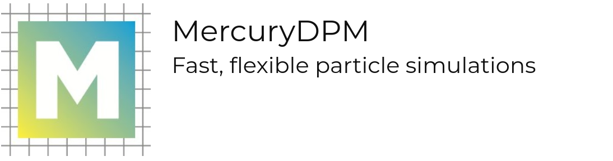
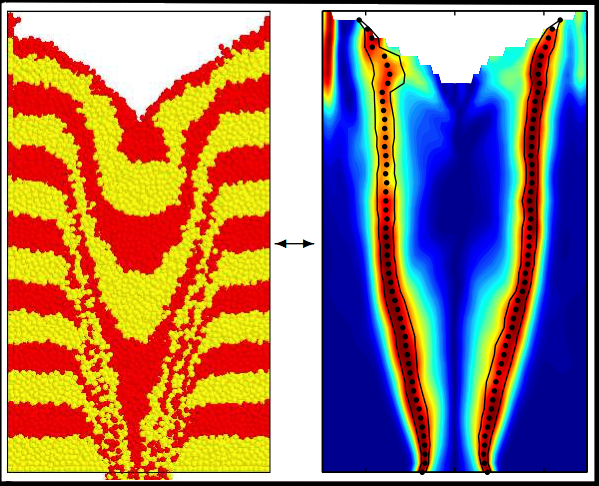
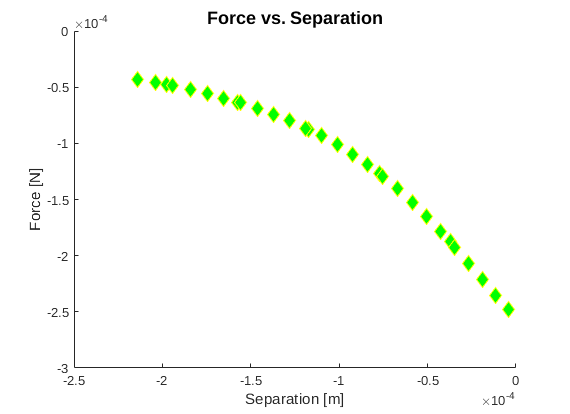

**MercuryDPM** is an open-source code for discrete particle simulations. That is, it simulates the motion of particles, or atoms, by applying forces and torques that stem either from external body forces, (e.g. gravity, magnetic fields, etc...) or from particle interaction laws (e.g. Lennard-Jones). For granular particles, these are typically contact forces (elastic, plastic, viscous, frictional), while for molecular simulations, forces typically stem from interaction potentials (e.g. Lennard-Jones). The code has been developed extensively for granular applications, but could be adapted to include long-range interactions as well. It has been developed by many people since it was started. Information about developers can be found at [Team](https://sites.google.com/mercurydpm.org/mercurydpm2/about/team?authuser=0).

MercuryDPM was started in 2009 by Anthony Thornton and Thomas Weinhart with the aim of creating a discrete particle method software able to solve complex industrial scenarios. This required several features which now form the backbone of MercuryDPM: (i) A flexible implementation allowing complex wall and boundary conditions, (ii) a neighbourhood detection algorithm capable of dealing with highly polydisperse particle packings, and (iii) an analysis tool able to extract the most relevant information from the huge amount of data generated by these simulations. The code also has been coupled to the continuum solver oomph-lib to simulate particle interactions with elastic solids, as well as multiscale coupling to simulate granular materials in a computationally efficient way.

MercuryDPM is a versatile, object-orientated C++ code which (we hope) is easy to understand. It is regularly tested on several Linux distributions, Mac OS and Windows 10. To avoid breaking already existing code, a suite of over 260 self-tests has been developed, testing each feature of the code. Developing new applications in the software is straightforward: The user specifies the particulars of their simulation (initial positions, inflow, outflow, walls, interaction parameters) in a single driver file, which calls the MercuryDPM kernel to execute the simulations. All kernel features are documented, and there are many sample drivers demonstrating the features.

Building the code is managed using cmake, the test suite via ctest, for code maintenance (bug reporting/tracing, release planning, etc) we use the Atlassian tools: Jira and Confluence. For visualisation we use both Paraview and an in-house code from Stefan Luding: XBalls. The latest version of the code can be found at https://bitbucket.org/mercurydpm/mercurydpm.

[](https://www.youtube.com/watch?v=Egk16RW2Ur8)

# Installation
**Below you find instructions to download the developer's version of MercuryDPM**, also called the "master". Note, **the developer's version contains the newest features of the code**, whose interface might still be unstable. If you want the most recent stable version of Mercury, please [download the release](https://www.mercurydpm.org/downloads/release-1-0-0-alpha) instead.

Download and installation instructions for various operating systems:
+ [Linux](https://www.mercurydpm.org/downloads/developers-version/linux)<sup>*</sup>
+ [Mac](https://www.mercurydpm.org/downloads/developers-version/mac)
+ [Windows](https://www.mercurydpm.org/downloads/developers-version/windows10)


# For users
After installing MercuryDPM and successfully running the self-test suite (explained in the Installation), you can proceed to test the newly implemented liquid bridge model under the name "TwoParticleBagheriCollisionSelfTest". In this test two particles are symmetrically placed in a bi-axial box. The particles move toward each other due to an initial velocity. Upon contact, a liquid bridge forms between them. As the particles bounce back and their separation increases, the liquid bridge remains intact until the distance between the particles exceeds a critical threshold, known as the rupture distance. This simulation evaluates the liquid bridge force, wall interactions, and the symmetry of the system.

### Steps to Run the Test

1. **Navigate to the Test Directory**:  
   Change to the directory containing the C++ files for interaction testing:
   ```bash
   cd MercurySource/Drivers/SelfTests/Interactions/

2. **Adjust Simulation Parameters**:
   
   Open the file `TwoParticleBagheriCollisionSelfTest.cpp` to modify simulation parameters. For instance, to change the particle radii, update the following lines:
   ```cpp
   p0.setRadius(0.0005);
   p1.setRadius(0.0008);
   ```
   and setting the gravity to zero
   ```cpp
   setGravity({0.0,0.0,0.0}); //default is setGravity({0.0,-9.81,0.0})
   ```
   To adjust the intervals for saving results, modify the `setSaveCount` parameter:
   ```cpp
   twoParticleBagheriCollisionProblem.setSaveCount(twoParticleBagheriCollisionProblem.getTimeMax()/twoParticleBagheriCollisionProblem.getTimeStep());
   ```
   You can set it to a specific number, like 25:
   ```cpp
   twoParticleBagheriCollisionProblem.setSaveCount(25);
   ```
4. **Compile the Test**:
   
   Save your changes and navigate to the corresponding directory in MercuryBuild to compile the test:
   ```bash
   cd MercuryBuild/Drivers/SelfTests/Interactions/
   ```
   Optionally, create a directory for storing simulation results:
   ```bash
   mkdir test
   ```
   Compile the `TwoParticleBagheriCollisionSelfTest` component:
   ```bash
   make TwoParticleBagheriCollisionSelfTest
   ```
5. **Run the simulation**:
   
   Copy the compiled file to the test directory and navigate into it:
   ```bash
   cp TwoParticleBagheriCollisionSelfTest ./test/
   cd test
   ```
   Execute the simulation with:
   ```bash
   ./TwoParticleBagheriCollisionSelfTest
   ```

The results are now stored in `.fstat` and `.vtu` files, which contain data for plotting diagrams and for visualization, respectively.

### Visualise and analyse data

This [video](./Matlab/TwoParticleBagheriCollisionSelfTest/TwoParticleBagheriCollisionSelfTest.mp4) shows the simulation results rendered via paraview.

In order to plot the liquid bridge force as a function of separation distance between particles, one can use the **Matlab** codes provided in [this folder](https://github.com/meysam-bagheri/demo-repo2/blob/master/), `PlotForceDelta.m` and `read_fstat.m`.
In `PlotForceDelta.m` the `fstat_path` should be modified to match the path of the saved results:
```matlab
fstat_path = 'full/path/to/MercuryDPM/MercuryBuild/Drivers/SelfTests/Interactions/test/'
```
Runing the code will generate the following plot, which is similar to the results of Figure 3 (a) in the article.



# Learning Mercury
For those interested in learning how to use existing Mercury codes to their full potential and even to design and create their own codes in order to model their own unique systems, the Mercury team offer short, intensive training courses. Details of these courses may be found on our sister website [mercurylab.org](https://www.mercurylab.org/?page_id=14).


# Join the community
The code base of MercuryDPM is and will stay **open-source**. Everyone can be part of it:

+ **Contribute** to the code on [Bitbucket](https://bitbucket.org/mercurydpm/mercurydpm/src/master/) and become a part of the [development team](https://www.mercurydpm.org/about/team).

+ **Ask for help and help others** at our [global questions board](https://mercurydpm.atlassian.net/wiki/spaces/CQ/overview) in Confluence, register and watch the space to receive news.

+ **Report issues** directly in [Jira](https://mercurydpm.atlassian.net/jira/software/c/projects/MDPM/issues/?filter=allissues&jql=project%20%3D%20%22MDPM%22%20ORDER%20BY%20created%20DESC) or using the "Found a bug" button in the [website](https://www.mercurydpm.org/) and help us solve them for everyone.

+ **Create documentation on-the-fly** using Doxygen directly in your code, see also the [coding style guidelines](https://www.mercurydpm.org/for-developers/coding-style).

+ **Contribute to the code base** by creating pull requests in [Bitbucket](https://bitbucket.org/mercurydpm/mercurydpm/src/master/), see the information for [developers](https://www.mercurydpm.org/for-developers).

+ **Meet the open-source community** by visiting our yearly [MercuryMay Hackathon](https://www.mercurydpm.org/mercurymonth).

